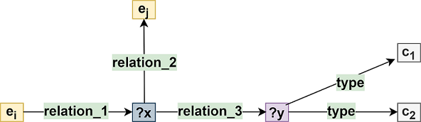

[](LICENSE)

<p align="center"></p>

<p align="center"><b>BioKBQA - Biomedical Knowledge Base Question Answering</b></p>

A solution that uses natural language to formulate questions to be answered by this semantic data without direct use of formal query languages.

### Main Features!

  - Converting natural language questions into a logical representation
  - Allowing users to use natural language interfaces
  - Creating biomedical datasets semantic descriptions
  - Promoting data findability, accessibility, interoperability, and reusability

### Documentation

More documentation about the system is available [here](https://github.com/bioinformatics-ua/BioKBQA/wiki).

### Team
  * Arnaldo Pereira<sup id="a1">[1](#f1)</sup>
  * João R. Almeida<sup id="a1">[1,](#f1)</sup><sup id="a2">[2](#f2)</sup>
  * Rui P. Lopes<sup id="a3">[3](#f3)</sup>
  * José L. Oliveira<sup id="a1">[1](#f1)</sup>

1. <small id="f1"> University of Aveiro, Dept. Electronics, Telecommunications and Informatics (DETI / IEETA), Aveiro, Portugal </small> [↩](#a1)
2. <small id="f4"> University of A Coruña, Dept. of Information and Communications Technologies, A Coruña, Spain </small> [↩](#a4)
2. <small id="f3"> CeDRI, Polytechnic Institute of Bragança, Bragança, Portugal </small> [↩](#a3)

### Cite

Please cite the following, if you use BioKBQA in your work:

```bib
In progress...
```

### Issues
Please let us know if there are any
[issues](https://github.com/bioinformatics-ua/BioKBQA/issues).

### License
BioKBQA is under GPL-3.0 license. For more information, click
[here](https://github.com/bioinformatics-ua/BioKBQA/blob/master/LICENSE).
